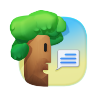

# DialogueForest  

DialogueForest is an [Outliner](https://en.wikipedia.org/wiki/Outliner) that is focused towards writing game dialogue:  
You can easily write multiple long text exchanges in a node, then link said node to other ones through VN-style prompts.  

I wrote this tool as I wasn't satisfied with any existing software to write text/dialogues for my games (my best functioning setup was an excel sheet with macros so you can guess how messy that was).  
As such, it's laid out in a very personal way, but I thought I'd release it if it can help anyone else.  

## Features:  

- Write Dialogue Nodes with multiple text blocks and customizable per-block characters, and link them to each other through prompts  
- Store your nodes in Dialogue Trees, where they can be displayed either as cards or in tree form  
- Pin nodes to access them in one easy list  
- Automatically saves your work, even if the app is closed  
- Rich text support  
- Set predefined characters to easily use when writing  
- Set custom metadata for dialogue nodes, either strings, colors or booleans  
- Export your Trees to JSON, with rich text formatted using either HTML, Markdown or BBCode  
- Basic daily word objective functionality with notifications and streak counting  

## Translation

You can easily contribute translations to DialogueForest! To help translate, follow these instructions.

### Adding a new language (requires Visual Studio 2019 or above)
- Create a new issue with the subject `[Translation] fr-CA` where you replace `fr-CA` with whatever language-region code you'll be translating into.
    - If an issue already exists, then don't do this step.
- Fork and clone this repo
- Open in VS
- In the `DialogueForest.Localization` project, find the `Strings` folder.
- Create a new file inside `Strings` that looks like this: `Resources.en-US.resx` but using the language you're translating into.
- Copy all the existing data from `Resources.en-US.resx` into your new `Resources.[language].resx`
- Translate the strings from english to your language
- Once done, then commit > push > create pull request!

### Improving an existing language (can be done with any text editor)
- Fork and clone this repo
- Open the `.resx` file (e.g. `Resources.en-US.resx`) you want to edit. Choose any text editor
- Translate
- Commit > push > create pull request!

## Screenshots
